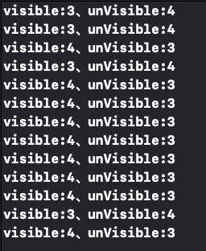

# MZHTableView
高性能横向TableView，支持cell复用

<div align=center>

</div>

以上图示例展示的效果，cell复用结果如下:
1000列的cell，cell复用池的cell总量为7

<div align=center>

</div>

#### Cocoapods 引入
```
pod 'MZHTableView', '~> 0.0.1'
```

#### 使用
```
let tableView = MZTableView(frame: CGRect(x: 0, y: 100, width: SCREEN_WIDTH, height: 100))
// 代理
tableView.delegate = self
// 注册class,实现cell复用功能
tableView.register(MZHTableViewCell.classForCoder(), forCellReuseIdentifier: "MZHTableViewCell")
self.view.addSubview(tableView)

// 注册nib,实现cell复用功能
tableView.register(UINib(nibName: "MZHTableViewCell", bundle: nil), forCellReuseIdentifier: "MZHTableViewCell")

// 通过已组册的identifier来获取cell
let cell = tableView.dequeueReusableCell(withIdentifier: "MZHTableViewCell") as! MZHTableViewCell

// 刷新数据
// 是否滚动到最左边 默认为false
self.tableView.reloadData(true)
```
